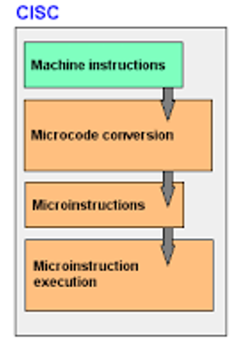
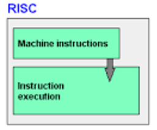
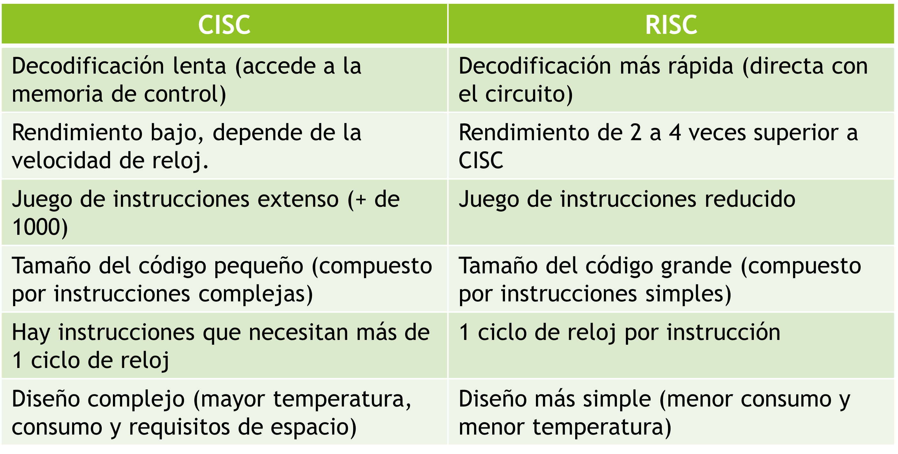
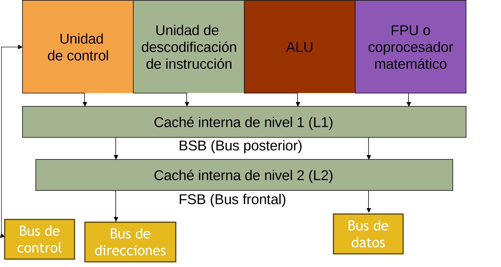
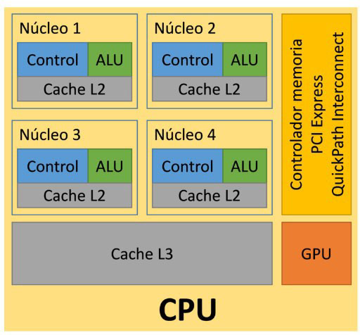

# CISC/RISC

---

## CISC (Complex Instruction Set Computer)

- También llamados procesadores de lógica programada.
- Para modificar el funcionamiento del microprocesador, sólo habría que modificar los microprogramas de su memoria de control.
- Se pueden añadir nuevas instrucciones código máquina o modificar las existentes.
- Son procesadores de propósito general.
- Aceptan juegos de instrucciones más extensos y complejos que los procesadores RISC.
- Hoy por hoy, copan el mercado de microprocesadores.

## ¿Cómo se ejecutan las instrucciones en un microprocesador con arquitectura CISC?

1) El secuenciador recibe la instrucción código máquina a ejecutar del registro de instrucciones.

2) El secuenciador accede al microprograma asociado a esa instrucción que está en la memoria de control

3) El secuenciador coge una a una las microinstrucciones y las envía para que se ejecuten.

## RISC (Reduced Instruction Set Computer)

- También llamados procesadores de lógica cableada.
- No existe una memoria de control, ni tampoco microprogramas. 
- La unidad de decodificación consta de un circuito complejo, que realiza la función de traducir una instrucción de código máquina en una secuencia de microinstrucciones a ejecutar por la unidad de control.
- Son procesadores de propósito específico.
- Para modificar su funcionamiento habría que rediseñarlos y reconstruirlos.
- Rendimiento de dos a cuatro veces superior que CISC

--- 

# Arquitectura interna 

## Diagrama de bloques de una CPU

## Diagrama de bloques de una CPU multicore

---

