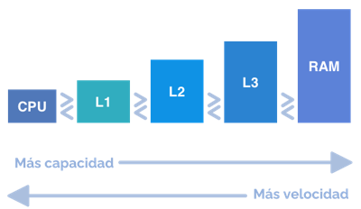
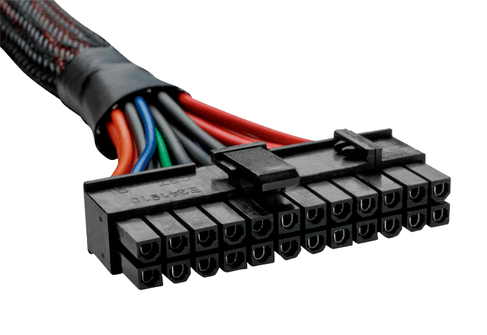
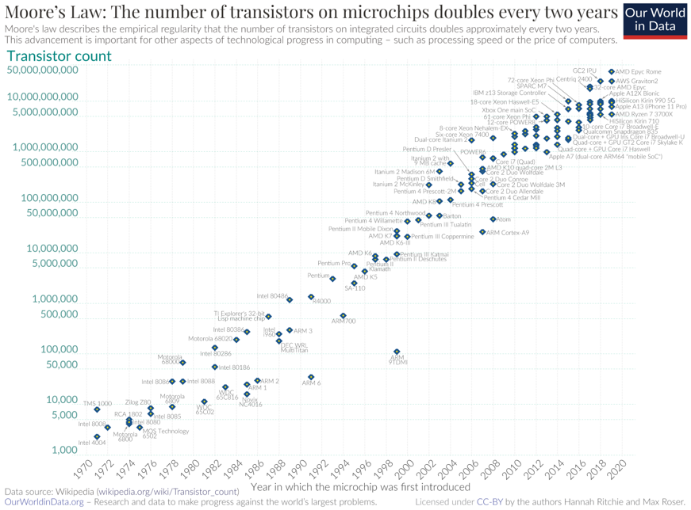
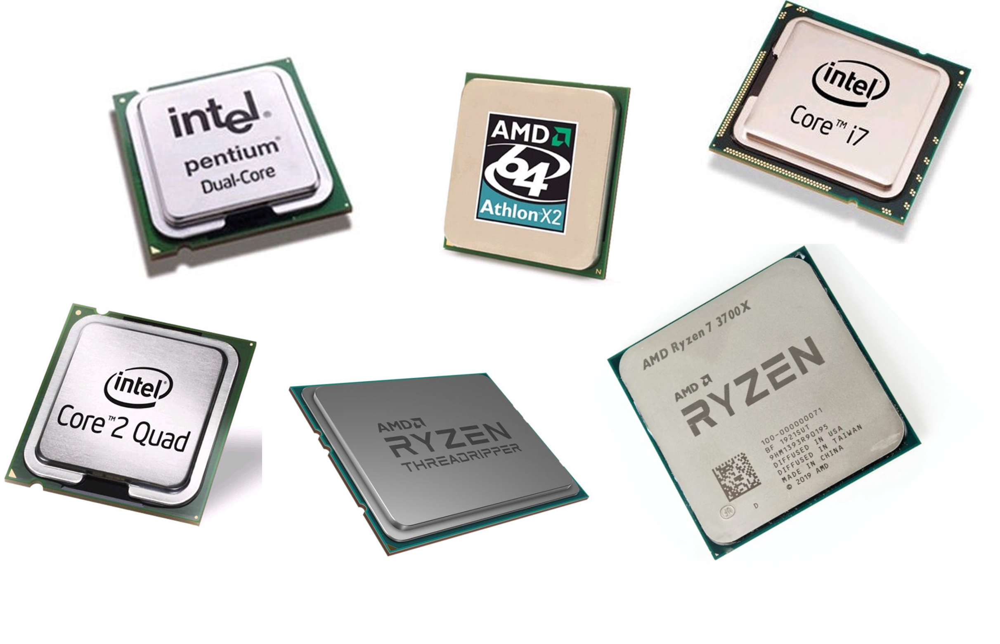

# Velocidad del procesador

- Se expresa en hercios (Hz).
    -  1 Hz = 1 ciclo de reloj por segundo
    - 1 MHz = 106  Hz (1 millón de hercios)
    - 1 GHz = 109  Hz (1.000 millones de hercios)

- Velocidad. Se definen dos velocidades:
    - Velocidad interna
    - Velocidad externa, bus del sistema o FSB (modelo clásico)

**Velocidad interna = Velocidad externa x Multiplicador** 

# Memoria caché

- Memoria intermedia entre la memoria principal y el procesador.
- Memoria más rápida que la memoria principal, pero de menor tamaño.
- Almacena copia de los datos más utilizados.
- Permite reducir el tiempo medio de acceso a los datos.
- Puede separarse en caché de datos o instrucciones.
- En procesadores de varios núcleos puede ser exclusiva de cada núcleo o compartida.

# Alimentación

- El micro recibe alimentación de la placa base.
- Dos tipos de voltaje:
    - Externo o de E/S 
    - Interno o de núcleo
- En las placas antiguas se podía configurar el voltaje suministrado al procesador.
- Los procesadores actuales permiten que la placa determine el voltaje adecuado.

# Repertorios de instrucciones

Conjunto de instrucciones para aplicaciones multimedia y 3D.

- MMX (Pentium) y 3DNow! (AMD K6)
    - En una única instrucción operaciones con varios datos.
    - Permite hasta 4 operaciones en coma flotante por ciclo de reloj.
- SSE o MMX-2(Pentium III)
    - 70 instrucciones más (acceso a memoria, mpeg-2, reconocimiento de voz, etc.)
    - Uso de forma simultánea con la FPU.
- SSE2 (Pentium IV)
    - 144 instrucciones para cálculos de doble precisión (128 bits)
- SSE3 (Prescott)
    - Instrucciones para el manejo de hilos (threads).
- SSE3 (Intel Core 2 Duo y Xeon)
    - 32 instrucciones para mejorar la velocidad de ejecución.
- SSE4 (Intel Core2 e Intel Core 1st gen)
    - 47 instrucciones instrucciones en Intel Core2 (SSE4.1)
    - 7 instrucciones adicionales en Intel Core 1st gen (SSE 4.2)
- AVX (Intel Core 2nd gen) y AVX2 (Intel Core 4th gen)
    - Instrucciones de 256 bits para uso intensivo de punto flotante
- AVX-512 (Intel Core 7th gen)
    - Procesa el doble de elementos que AVX y AVX2 en una sola instrucción

# TDP

- Son las iniciales de Thermal Design Power
- Aunque se mide en vatios (W) no hace referencia al consumo del procesador, sino al calor que desprende
- Indica la cantidad máxima de calor que se espera que un componente produzca en un escenario de uso intenso
- Aunque el TDP no mide el consumo eléctrico del procesador, sí está relacionado directamente con este
- El TDP puede ser una medida que ayude a elegir la refrigeración adecuada para un procesador
- Algunos procesadores pueden, en situaciones de buena refrigeración, exceder su TDP nominal e incrementar su rendimiento

# Tecnología

- El elemento básico que componen un microprocesador es el transistor.
- En un microprocesador actual hay millones de transistores.
- El tamaño de los transistores se ha ido reduciendo.
- En la actualidad del orden de nanómetros (nm)
- 1 nm = 10^-9
- En poco tiempo cambiaremos a la siguiente unidad de medida, el Ángstrom (Å)
- 1 Å = 10-10 m = 0,1 nm

# Ley de Moore 

- Promulgada en 1965 por Gordon Moore (cofundador de Intel)
- Redefinida por él mismo en 1975
- Esta ley empírica establece que **el número de transistores** por unidad de superficie en los procesadores **se duplica aproximadamente cada dos años**.
- La consecuencia directa de la ley de Moore es que los precios de los - procesadores bajan al mismo tiempo que las prestaciones suben
- No se trata de una ley en el sentido científico de la palabra, sino de una observación empírica que se viene cumpliendo desde la década de los años 

# Número de núcleos

Número de núcleos integrados en un solo chip y funcionando en paralelo.

