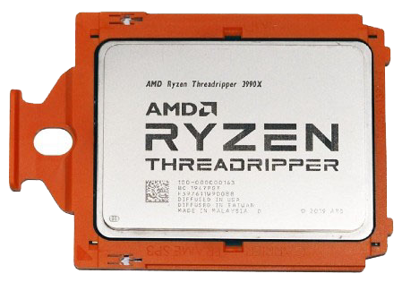
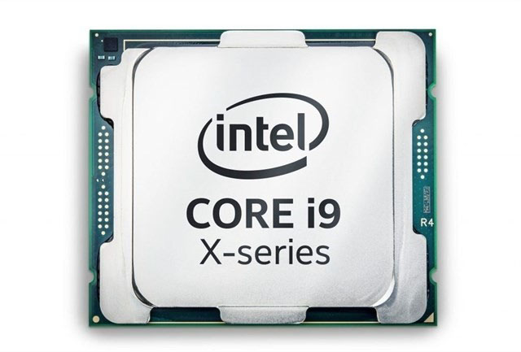

# Introducción

???+ note "Licencia"
     Daniel Álvarez Santamaría

---

# El procesador

- Elemento de la arquitectura de Von Newmann
- Componente principal del ordenador
- Dirige y controla el resto de los componentes
- Decodifica y ejecuta las instrucciones de los programas cargados en la RAM
- Es un circuito integrado o chip
- Lo encontramos en ordenadores, móviles, tablets, electrodomésticos, consolas, etc.
- 2 principales fabricantes: INTEL y AMD

