# Athlon

Versiones de dos y cuatro núcleos físicos. 

Ofrecen un buen rendimiento general, sin llegar a los niveles de los procesadores actuales.

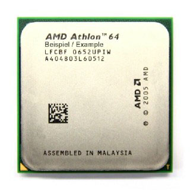      

# APUs

Procesadores de dos y cuatro núcleos con GPU integrada en el procesador, en algunos casos de alto rendimiento. 

Algunos ejemplos son: A1, A6, A10, etc.

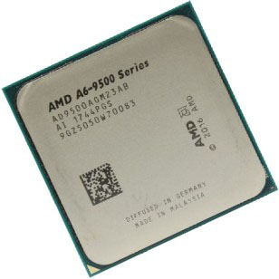

# FX 4300

Cuatro núcleos y frecuencias de trabajo muy altas.

Buen rendimiento general.

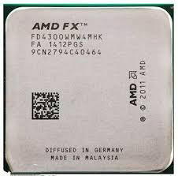

# FX 6300

Seis núcleos y frecuencias de trabajo muy altas.

Un peldaño por encima de los FX 4300

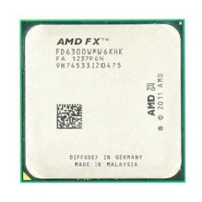

# FX 8300

Ocho núcleos y frecuencias de trabajo >4 GHz.

Altísimo TDP (generan mucha temperatura)

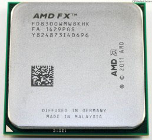

# Familia Ryzen

Actual familia de procesadores de AMD

Arquitectura con litografías de hasta 5 nm

Versiones de hasta 16 núcleos y 32 hilos

Se dividen en varias subfamilias:

# Ryzen 3

Cuatro núcleos, ocho hilos

Es el procesador más básico de esta familia

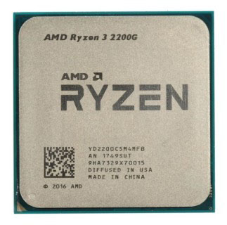

# Ryzen 5

Entre cuatro y seis núcleos, de ocho a doce hilos

Equivalente (aprox.) a un Core i5

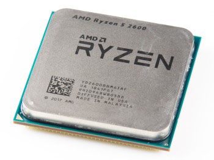

# Ryzen 7

Ocho núcleos, dieciséis hilos

Muy alto rendimiento y precio elevado

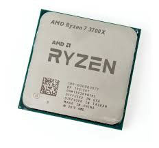

# Ryzen 9

Procesador de gama alta y precios muy elevados

16 núcleos, 32 hilos

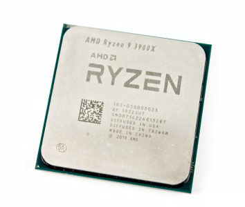

# Ryzen Threadripper

Versiones de hasta 96 núcleos y 192 hilos

Diseñado para servidores

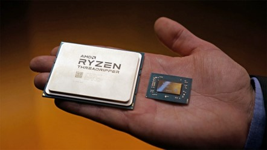

# Significado del marcado de AMD

Al igual que Intel, AMD marca sus procesadores de forma que se indica la generación, modelo y otros datos de interés:

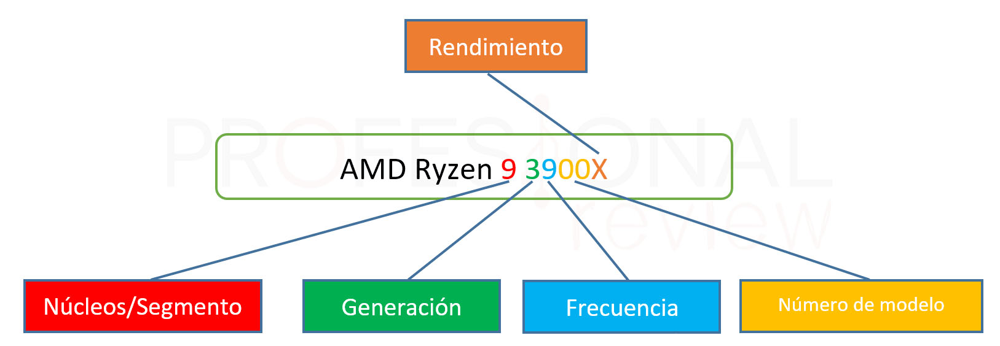

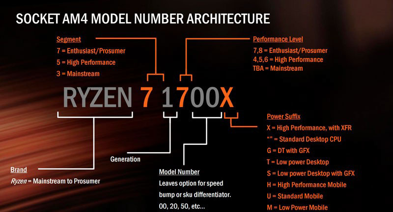