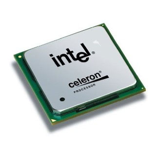
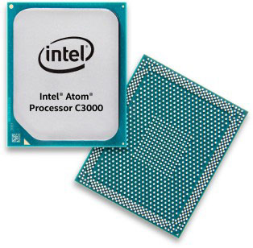
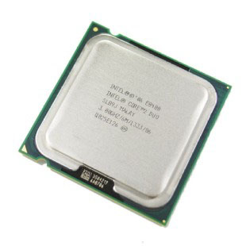
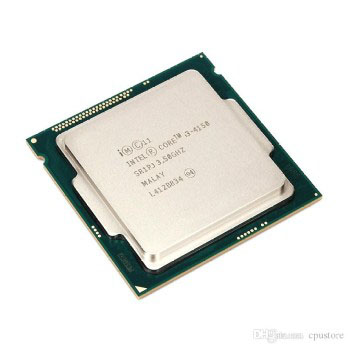
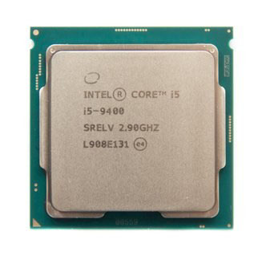
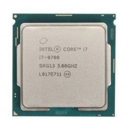
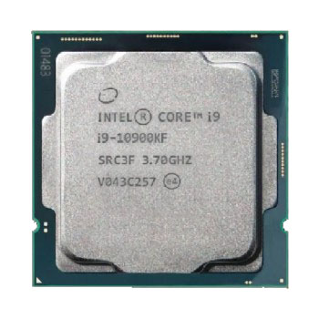
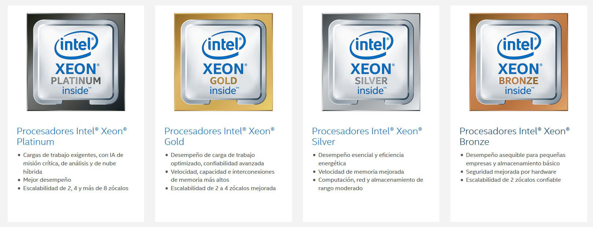
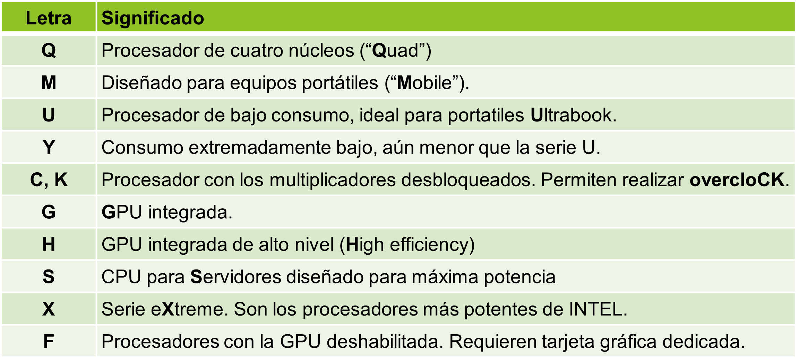
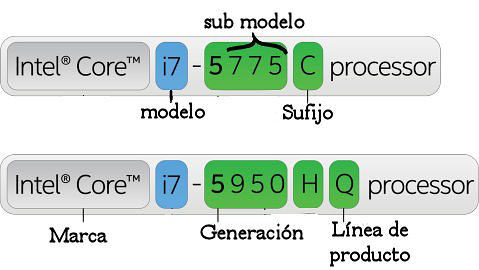

# Celeron

Son procesadores económicos con dos núcleos físicos que ofrecen un buen rendimiento en ofimática general, multimedia y navegación.

# Atom

Procesadores de bajo consumo, utilizados en dispositivos móviles, tablets y ordenadores notebooks.

# Pentium Core2Duo

Mejoran el rendimiento frente a los anteriores ofreciendo mayores frecuencias de reloj. Mantienen dos núcleos. 

      

# Pentium Core2Quad

Mayores frecuencias de reloj que los Core 2 Duo

Integran cuatro núcleos. 

      

# Familia Intel Core

Son los que tenemos actualmente en el mercado

Han desbancado a las familias anteriores

Se dividen en varias subfamilias:

# Intel Core i3

Hasta 8 núcleos y 12 hilos (13 gen)

Adecuado para equipos económicos con rendimiento de ofimática

      

# Intel Core i5

Hasta 14 núcleos y 20 hilos (14 gen)

Hay versiones reducidas (“U”) con menos núcleos

Buena relación precio-rendimiento para presupuestos medios

      

# Intel Core i7

Hasta 20 núcleos y 28 hilos (14 gen)

Hay versiones reducidas (“U”) con menos núcleos

Mejoran el rendimiento de los i5. Uso profesional

      

# Intel Core i9

Hasta 24 núcleos y 32 hilos (14gen)

Sólo los aprovecharemos realmente si vamos a utilizar aplicaciones profesionales que dependan de una alta capacidad multihilo

      

# Serie X

Son los más potentes de la familia Intel Core

Utilizados para equipos que necesiten altas capacidades de rendimiento, como servidores en empresas de tamaño medio

Usan como base el diseño del Intel Core i9

      

# Intel XEON

Son los procesadores más avanzados diseñados por Intel

Hasta 56 núcleos y 112 hilos

Se usan para servidores de grandes empresas

Su precio es muy elevado

Existen versiones bronze, silver, gold y platinum y Max (usa memoria HBM)

      

# Significado del marcado Intel

      

      
