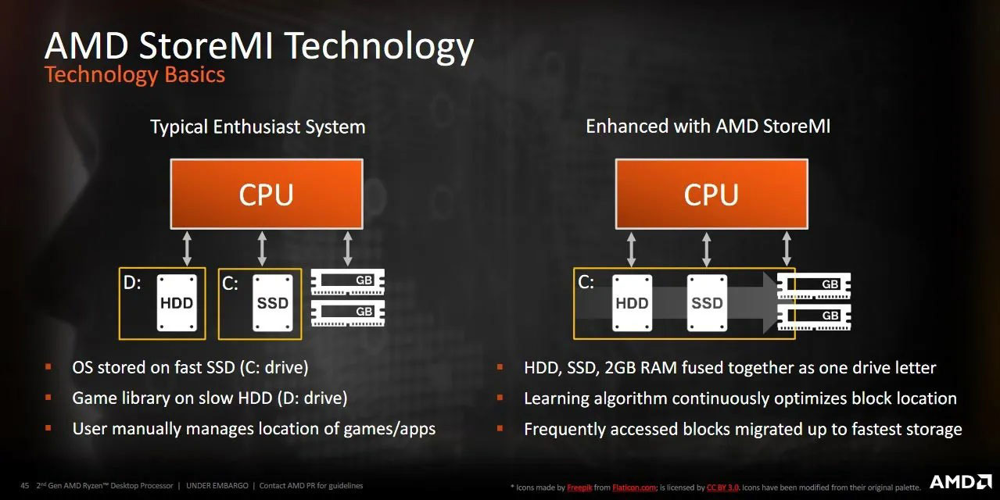
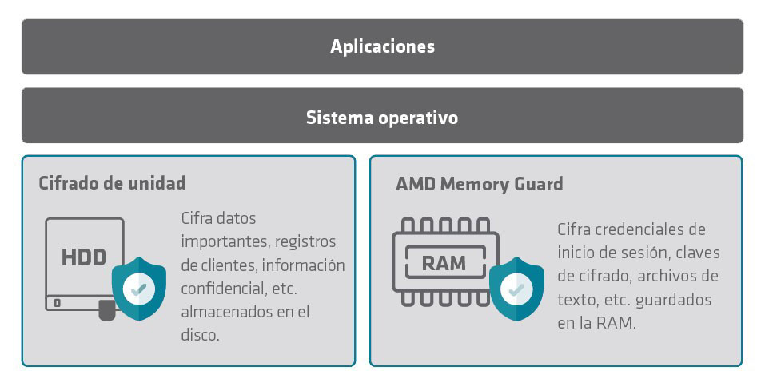
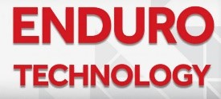

# SMT (Simultaneous MultiThreading)

- Tecnología equivalente al Hyperthreading de INTEL
- Permite ejecutar dos procesos en un core mediante hilos (threads)

# AMD Turbo Core 2

- Tecnología equivalente al TurboBoost de INTEL
- Alcanza incrementos de hasta 1 GHz

# AMD SVM (Secure Virtual Machine)

- Tecnología equivalente al VT-x de INTEL para virtualización

# AMD StoreMI

- Combina un disco SSD con un disco tradicional de mayor tamaño en una sola unidad 
- Automáticamente transfiere al disco SSD los datos a los que se accede con más frecuencia
- Disponible desde procesadores Ryzen de 2ª gen.

# AMD Memory Guard

- Cifra los datos de la memoria RAM independiente de las aplicaciones y del sistema operativo
- Protege la memoria del sistema en tiempo real para protegerla contra ataques físicos
- Disponible en procesadores Ryzen PRO

# AMD Enduro

- Se trata de una colección de funciones inteligentes destinadas a ahorrar energía de manera significativa
- Integra AMD ZeroCore Power y AMD Power Tune

# AMD ZeroCore Power

- Equivalente a la tecnología de estados de inactividad de INTEL

# AMD Power Tune

- Ofrece detección incorporada de la energía de la GPU para un mayor espacio y rendimiento de acuerdo con los requisitos térmicos del sistema 
- Ajusta la energía de la GPU de acuerdo con el rendimiento de las aplicaciones

