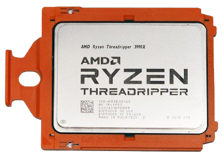

# Computación paralela

- Posibilidad de poder ejecutar varios programas a la vez, es decir, poder ejecutar más de una instrucción en los mismos ciclos de reloj.
- Debe estar preparado tanto el hardware como el software para soportarlo
- En la actualidad todos los procesadores soportan la computación paralela

# Arquitectura superescalar

- Permite aumentar el rendimiento sin introducir nuevos núcleos ni duplicar ningún elemento hardware.
- Se trata de solapar las etapas de ejecución de las instrucciones para evitar esperar a que se acabe de ejecutar la anterior antes de empezar la siguiente.
- Para llevar a cabo esto, se duplican o triplican ciertas unidades funcionales, como unidades de ejecución o registros.
- En la ALU, se tienen varias “minicalculadoras” o unidades de ejecución especializadas en un tipo de operación concreto, como aritméticas, lógicas, reales, saltos, etc. 
- Permite ejecutar partes de una misma instrucción de forma paralela.

# Arquitectura superescalar

Si una instrucción lleva 4 pasos, así se ejecutarían dos instrucciones en un ordenador superescalar:

# Arquitectura multicore

- Posibilidad de disponer de dos o más núcleos de en un sólo procesador.
- Cada núcleo puede ejecutar una instrucción distinta en el mismo ciclo de reloj, consiguiendo de esta forma una computación paralela real.
- Permite aumentar en gran medida el rendimiento del sistema.
- Actualmente existen microprocesadores con hasta 64 núcleos (AMD Threadripper Pro 7980X)

# Generaciones de diseño de procesadores

- Existen diversas generaciones de un mismo procesador
- Se diferencian entre si en mejoras en la integración y estructura de los componentes.
- Cada generación introduce mejoras de rendimiento. 
- Principalmente:
    - Disminución del consumo eléctrico.
    - Disminución de la temperatura de trabajo.
    - Aumento del IPC (instrucciones que se pueden ejecutar por ciclo).
    - Aumento del número de núcleos o el tamaño de la memoria caché.
