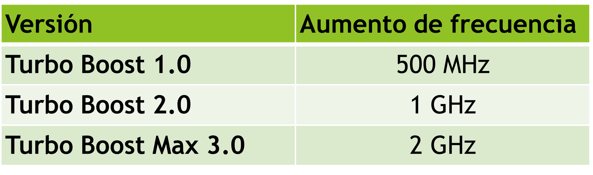
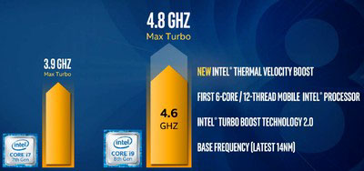
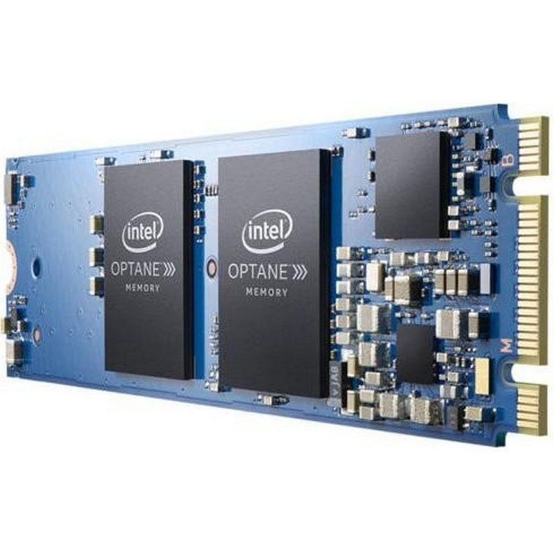
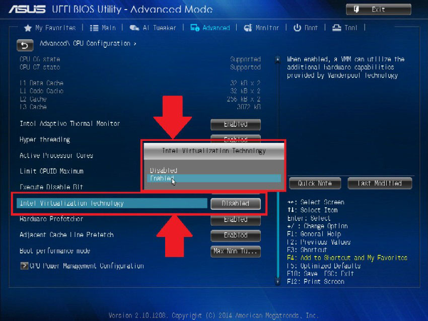
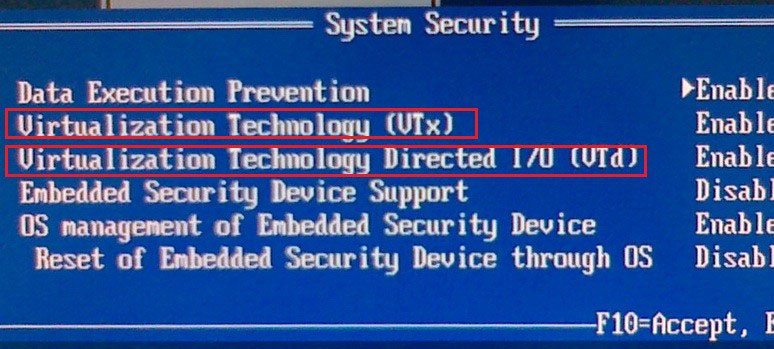

# Hyperthreading

- Permite que un procesador maneje dos conjuntos de instrucciones independientes (es decir, dos procesos independientes) al mismo tiempo.
- La CPU consta de dos conjuntos de registros de propósito general y propósito específico, pero sólo tiene una ALU, una unidad de control, una memoria caché, etc.
- Nunca se obtiene el mismo rendimiento que un equipo con dos procesadores. La mejora de rendimiento es de hasta un 30%.

# TurboBoost

- Se trata de analizar en tiempo real el porcentaje de ocupación de cada núcleo del microprocesador.
- En el caso de que la ocupación sea alta, aumenta automáticamente la frecuencia de reloj del núcleo.
- El aumento de frecuencia es independiente entre núcleos.
- Eleva mucho la temperatura y el consumo, por lo que cuando baja la carga o sube la temperatura de un núcleo, el sistema vuelve a bajar la frecuencia.
- Existen varias versiones:

# Thermal Velocity Boost

- Tecnología complementaria a TurboBoost.
- Permite elevar la frecuencia de cada núcleo del procesador hasta 200MHz, en caso de altas necesidades de rendimiento y siempre que la temperatura de dicho núcleo sea inferior a 50 grados centígrados.

# Memoria Intel Optane

- La memoria Intel® Optane™ es un tipo de memoria no volátil similar a un disco duro que se usa con el fin de acelerar el rendimiento del sistema.
- Se almacenan en ella programas y datos a modo de memoria caché para mejorar los tiempos de carga en RAM.
- Está situada entre al RAM y el almacenamiento de datos.
- Se conecta a puertos M.2 (PCI Express x4)

# Tecnología de virtualización VT-X

- Permite mejorar el rendimiento de sistemas operativos ejecutados en un  software de virtualización (VMWare, VirtualBox…)
- Las máquinas virtuales comparten recursos, por lo que, acceden directamente al hardware físico sin que tenga que intervenir el sistema operativo.
- Es indispensable para virtualizar sistemas de 64 bits.
- Debe habilitarse desde la BIOS del sistema.

 

# Núcleos E y núcleos P

- Disponible desde Intel Core 12gen (Alder Lake)
- Arquitectura híbrida: usa dos tipos de núcleos
- Núcleos P (Performance)
    - Más grandes en tamaño y también en potencia
    - Orientados al máximo rendimiento (y mayor consumo)
    - Son los únicos con Hyperthreading
- Núcleos E (Efficiency)
    - Menor tamaño y potencia
    - Orientados al bajo consumo (eficiencia energética)
- Se expresa el número de núcleos de los procesadores como una combinación de ambos.
- Ejemplo Intel 12900K: 8P+8E 
    - 8 P-Cores y 8 E-Cores. Nº hilos (threads): 2x8P + 1x8E = 24 hilos

# Estados de inactividad

- Permite el ahorro de energía mediante el “apagado” de diferentes módulos del procesador en caso de que el sistema no esté siendo utilizado.
- C0- Activo
    - La CPU está funcionando normalmente.
- C1- Pausa automática: 
    - El reloj del sistema está activado, pero no genera pulsos. 
    - El procesador no ejecuta las instrucciones código máquina, pero   puede volver a un estado de ejecución de forma casi instantánea.
- C2- Reloj de detención: 
    - El reloj del la CPU está desactivado. 
    - El procesador necesita más tiempo para arrancar.
- C3- Reposo: 
    - El reloj del sistema está desactivado. 
    - El procesador está en estado de reposo.
- C4- Deeper sleep: 
    - Gran reducción de consumo eléctrico. 
    - Se diferencia del estado anterior en el tiempo en el que la CPU volverá a arrancar.
